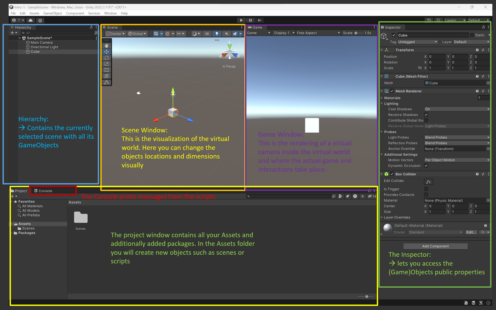

# Intro To Unity - First Unity Project:
## Setup Unity Account
- The Unity Hub lets you handle different installations of Unity Editors and manage your projects.
- If Unity Hub is not installed, get it from [here](https://unity.com/download).
- Create an account and activate the personal license (it is free).

## Install Unity Editor (skip if already installed)
- In the Unity Hub, select _Installs_ and click _Install Editor_ and install Version 2021.3.19f1 (LTS), or the latest 2021.3 LTS version.
## Create A New Project
- Click _New Project_.
- Select _3D Core_ (it might be called _3D (Built-in Render Pipeline)_), enter a project name, location and select Unity Cloud organization. Uncheck _Connect to Unity Cloud_ and _Use Unity Version Control_.
- _Create Project_.

  


## Get to know the Editor
Familiarize yourself with the Unity Editor window. You can customize the layout, store different layout templates and reset the layout to default.

- **Project** window shows the
    - **assets**: keeps all of your projects assets such as scenes, scripts, media, textures etc.
    - **packages**: the libraries that are currently added to the project, which can be made by Unity or third parties.
- **Scene** window shows the active scene's virtual environment. Any GameObject that is added to the scene will also have a gizmo in the scene window.
- **Hierarchy** window displays active scene(s) and the GameObjects in each scene.  
    A GameObject
    - - can contain multiple components (MonoBehaviour scripts).  
            \- can be nested as parent or child object.  
            \- has always a Transform component attached to it which gives it's spatial dimension.  
            \- can be renamed.  
            \- can be tagged.  
            \- can be activated or deactivated.
- **Inspector** window shows the components of a GameObject. Here you can edit the script's _public variables_, manually add or remove _components_ and assign other components from the scene to public variables.





Play around with the scene and learn the commong shortcuts for manipulating GameObjects in the Scene:
- W : xyz positioning
- E : xyz rotation
- R : xyz scaling


## Create the first script

- Create a folder for your scripts and create a new script.
- While Unity uses C# as programming language, GameObjects can only contain _MonoBehaviour_ classes. Therefore, your script name needs to be always followed by "_:MonoBehaviour_".

  E.g.:
  
```cs
  using UnityEngine;
  public class MyFirstScript : MonoBehaviour
  {
      void Start()
      {
          Debug.Log("Hi World");
      }
  }
```
        
- `void Start()` is executed once when the scene is started in playmode and the GameObject is initialized.
- `void Update()` is called once per rendered frame, which means it is a good way for updating parameters smoothly.
- [Here you can learn more about the differences](https://learn.unity.com/tutorial/awake-and-start) between Unity's initialization calls like Awake, OnEnable, Start etc. 
- The **Console** window shows the log that is outputted from scripts. You can filter what type of logs you want to see and you can search for keywords in the output texts. Double clicking on a log opens up the script that caused it.

    


- Public variables are declared by the word _public_ before the variable type. Variables can be of different types, with the most common ones being: _int_, _float_, _string_, _bool_, _GameObject_, _Transform_.

- E.g. the `public GameObject` lets you assign a GameObject from your scene and access its properties, like e.g. the Transform component, which holds the spatial information about the object: position, rotation and scale. So a GameObject **always** has a Transform, but a Transform never has a GameObject.  The Transform of a GameObject is accessed by `myGameObject.transform`
- By calling the `Translate()` function on a Transform during `Update()`, you can automate position, rotation and scale.


## More resources:

- For a more thourough (17minutes) introduction to Unity check out [this video from CodeMonkey](https://www.youtube.com/watch?v=E6A4WvsDeLE).
- The official Unity learning tutorials [for begginner scripting](https://learn.unity.com/project/beginner-gameplay-scripting?uv=2019.3) and [intermediate gameplay scripting](https://learn.unity.com/project/intermediate-gameplay-scripting) will also provide you with a good foundation for later tasks.

Keep in mind: While Unity lets you work visually with components and doesnt require you to code, a better understanding of C# will give you more power for designing and creating sophisticated and complex interactions.
