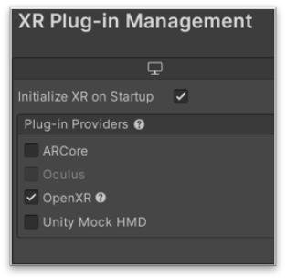

# Intro To VR - Our First VR Project:

## VR Use Cases
- Interactive experiences
- 360-video players
- Data exploration / visualisation
- Industrial planning, simulating & engineering (e.g. for architecture, automotive, medicine, etc.)
- Studies & experiments
- and more ...

## Setup Hardware And Software

### Creating a Meta Developer Profile
For quick building and deploying of your own VR applications, you will need to set the device to _Developer Mode_. Meta requires you to register a developer account for this.
1. Go to: <https://developer.oculus.com/manage/organizations/create/>
2. Create an account and log in.
3. You will need to register a phone number in order to make your account a developer account.
4. Enter some custom name as developer organization’s name. It doesn't really matter for now.
5. You will need to agree to the Non-disclouser agreement.
6. Go to <https://developer.oculus.com/manage/verify/> to verify your account.
7. Now download the Meta Horizon app to your smartphone using the respective links for [Android](https://play.google.com/store/apps/details?id=com.oculus.twilight&pli=1) or [iOS](https://apps.apple.com/us/app/meta-quest/id1366478176).
8. Log into the app using your Meta developer credentials.
9. Connect your VR headset with the app and carry out the setup process as guided. If there are multiple Quest VR headsets around you, make sure you identify the correct one for pairing, by e.g. turning it off and identifying which of the IDs disappeared. For additional information on setting up your Meta Quest, see: [Getting started with your Meta Quest](https://www.meta.com/en-gb/help/quest/articles/getting-started/getting-started-with-quest-2/)
10. In the app, proceed to: Devices > Developer Mode and make sure to switch on Developer Mode using the provided toggle.
11. Connect your headset to your computer and **allow the USB connection**.

## Setup Unity Project For VR
Make sure you have the Android module installed for the UnityEditor that you are using. Otherwise add the module.

1. Open your Unity Project.
2. Edit > Project Settings -> XR Plug-in Management -> **Install XR Plugin Management**.
3. Once it is installed, tick _OpenXR_ under Plug-In-Providers. This will take a moment, just be patient. When asked whether you want to activate the _New Input System_ click yes. The Unity Editor will be restarted.

4.
5. Before you can build the application to your VR headset, you need to change the plattoform to Android (since Meta Quest is based on the Android platform).
6. Within the Android Settings section, ensure Oculus is selected.
- Navigate to: File > Build Settings
- Choose Android as your platform and select 'Switch Platform'.
- From the Run Device dropdown, select your device. If it doesn't appear, confirm that Developer Mode is on and click 'Refresh'.
- To commence the build and run process, click 'Build and Run'."

- In our Unity project, go to Window > Package Manager and make sure the *Packages: Unity Registry* dropdown is selected. This shows the available packages to install, while *In Project* displays the previously installed packages.
- Search for "xr" and install the *OpenXR Plugin, XR Interaction Toolit and XR Plugin Management.*

&nbsp;

- In the *Build Settings*, make sure to switch to Android.

&nbsp;

- In the Project Settings, open *XR Plug-in Management* and check *OpenXR*.

- Open *OpenXR* settings and add the Oculus Touch Controller Profile. Also check *Meta Quest Support,* *Mock Runtime* and *Runtime Debugger*. If a red exclamation mark appears next to either of the settings, click on it and select "Fix all".

&nbsp;

- In case the warning sign appears, click on it and fix the issues that appear under *Project validation*.

  	

# VR pipeline in Unity (theory)

- Device platform:  
    e.g. Android for MetaQuest, Windows for VivePro, …
- XR Plugin Provider:
    e.g. OpenXR for standardized SDK, ARCore for Google’s AR SDK,  
    Oculus for proprietary SDK
- OpenXR Settings:  
    add profiles for each device to support

  

# OpenXR
OpenXR serves as a standardization plugin for various VR and AR headsets, enabling developers to create XR experiences that can run on multiple XR devices without needing to rewrite code for each device or platform. It is an open, royalty-free standard for cross-platform VR and AR development, created by the Khronos Group. Before OpenXR, one had to use different plugins and APIs in Unity for each device, like Valve, Oculus, Lenovo, HoloLens etc.

# Locomotion - Turning

Choose either one:

- Snap Turn Provider:  
    turns player around by certain amount of degrees
- Continuous Turn Provider:  
    turns player around continuously while pressing the joystick  
    

&nbsp;

# Interactables

- Components for executing functions, based on interaction events
- E.g.: hovering is triggered from moving controller over the object. Select is triggered when selection button is pressed while hovering

 

&nbsp;

# Interactables - Simple Interactable

- Basic objects used for triggering events, e.g. via gaze or button interactions

&nbsp;

# Interactables - Grab Interactable

- Direct and physical form of interacting with virtual objects, e.g. for picking them up, rotating or scaling them

