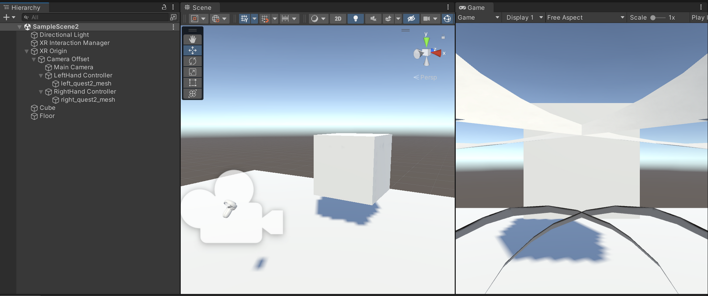
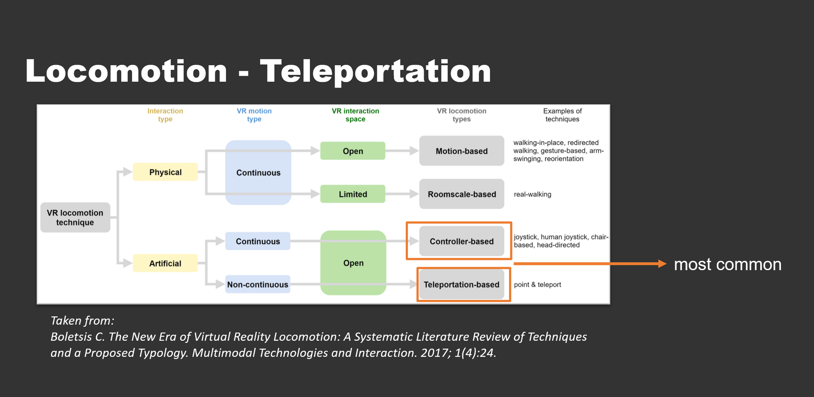
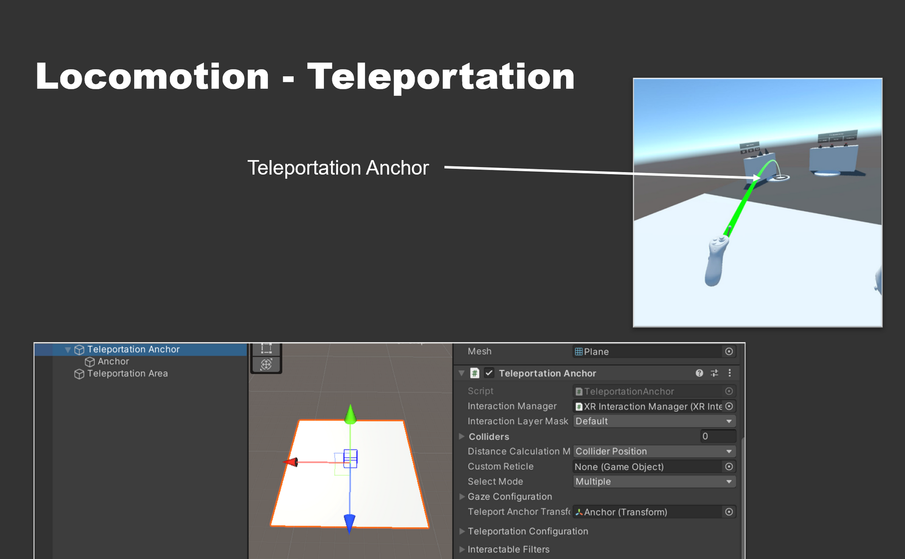
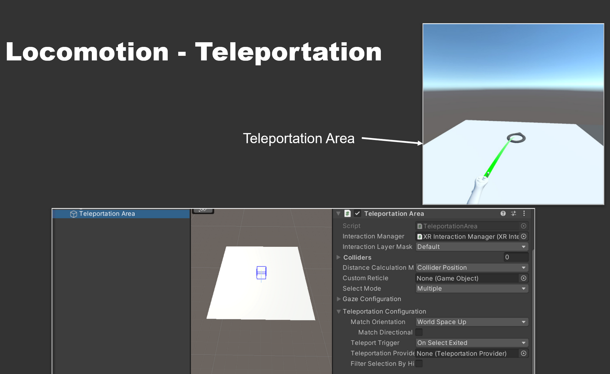

# OpenXR - Input
OpenXR serves as a standardization plugin for various VR and AR headsets, enabling developers to create XR experiences that can run on multiple XR devices without needing to rewrite code for each device or platform. It is an open, royalty-free standard for cross-platform VR and AR development, created by the Khronos Group. Before OpenXR, one had to use different plugins and APIs in Unity for each device, like Valve, Oculus, Lenovo, HoloLens etc.

# Locomotion - Turning

Choose either one:

- Snap Turn Provider:  
    turns player around by certain amount of degrees
- Continuous Turn Provider:  
    turns player around continuously while pressing the joystick  

# Interactables

- Components for executing functions, based on interaction events
- E.g.: hovering is triggered from moving controller over the object. Select is triggered when selection button is pressed while hovering

# Interactables - Simple Interactable

- Basic objects used for triggering events, e.g. via gaze or button interactions

# Interactables - Grab Interactable

- Direct and physical form of interacting with virtual objects, e.g. for picking them up, rotating or scaling them

