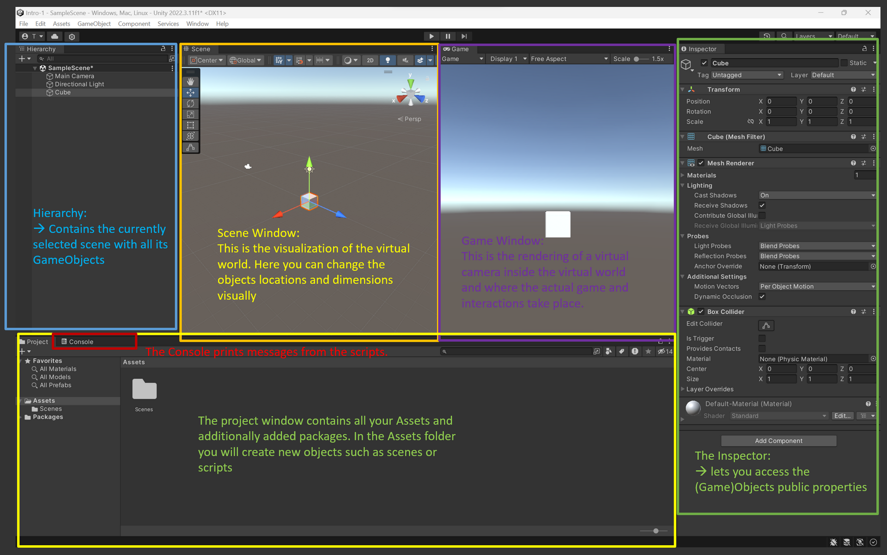
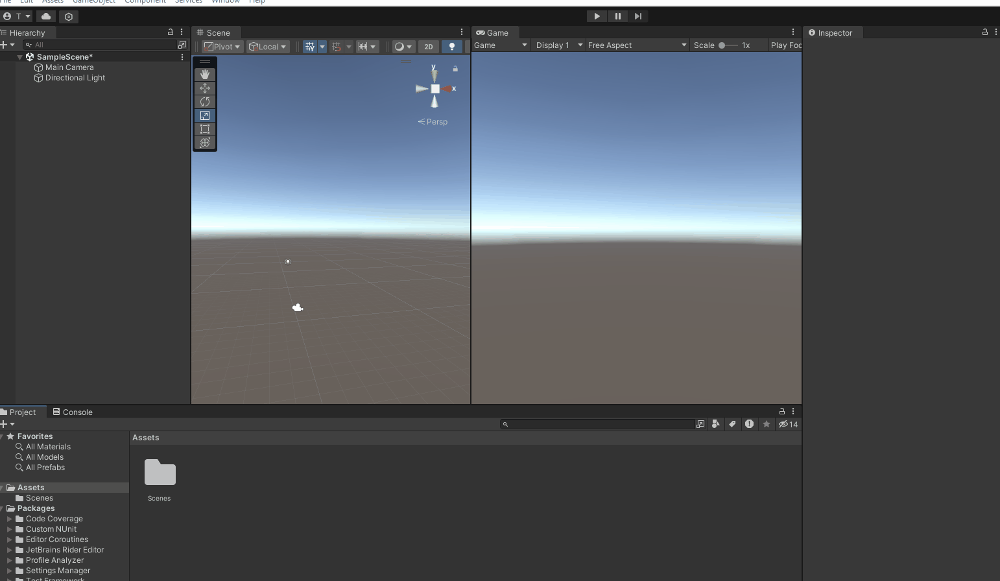

# Setup Unity Account

- Create account
- activate personal license

&nbsp;

# Create a new project

- In the Unity Hub, select *Installs* and click *Install Editor* and install Version 2021.3.19f1 (LTS), or the latest 2021.3 LTS version.
- Click *New Project*.
- Select *3D Core*, for now we don't need *URP*, enter a project name, location and select Unity Cloud organization. Uncheck *Connect to Unity Cloud*, as we don't need it. Also keep *Use Unity Version Control*.
- Click *Create Project*.

# Get to know the Editor

Familiarize yourself with the Unity Editor window. You can customize the layout, store different layout templates and reset to default.

- **Project** window shows the
    - **assets**:  
        keeps all of your projects assets such as scenes, scripts, media, textures etc.
    - **packages**:  
        the libraries that are currently added to the project, which can be made by Unity or third parties.

&nbsp;

- **Scene** window shows the active scene's virtual environment. Any GameObject that is added to the scene will also have a gizmo in the scene window.

&nbsp;

- **Hierarchy** window displays active scene(s) and the GameObjects in each scene.  
    A GameObject
    - - can contain multiple components (MonoBehaviour scripts).  
            \- can be nested as parent or child object.  
            \- has always a Transform component attached to it which gives it's spatial dimension.  
            \- can be renamed.  
            \- can be tagged.  
            \- can be activated or deactivated.

&nbsp;

- **Inspector** window shows the components of a GameObject. Here you can edit the script's *public variables,* manually add or remove components and assign other components from the scene to public variables.

&nbsp;

&nbsp;

* * *

- Play around with the scene.
- Shortcuts for manipulating a GameObject in the Scene window:
    - W : xyz positioning
    - E : xyz rotation
    - R : xyz scaling

&nbsp;

&nbsp;

# Create the first script

- Create a folder for your scripts. Create a new script.
    
- As mentioned earlier, a script needs to derive from MonoBehaviour `public class FirstMonoBehaviour : MonoBehaviour` (indicated by '" : "), in order to work as its own component on a GameObject.
    
- Classes have namespaces or are global. They can inherit from another class, like MonoBehaviour.
    
- The `void Start()` is executed automatically when the scene is started. `void Update()` is called once per rendered frame, which means it is not consistent when frames drop but can be a good way for updating parameters smoothly.  
    [Learn here more about the differences](https://learn.unity.com/tutorial/awake-and-start) between Unity's initialization calls like Awake, OnEnable, Start.
    
- The **Console** window shows the log that is outputted from scripts. You can filter what type of logs you want to see and you can search for keywords in the output texts. Double clicking on a log opens up the script that caused it.
    

&nbsp;

- The `public Transform` lets you access the Transform component of a GameObject. You can always assign other GameObject's components to public properties in the inspector.
- By calling the `Translate()` function on a Transform during `Update()`, you can automate position, rotation and scale.

* * *

# More resources:

- [This video from CodeMonkey](https://www.youtube.com/watch?v=E6A4WvsDeLE) wraps up the introduction into Unity and the Editor coherently.
- If you [go through these learning tutorials](https://learn.unity.com/project/beginner-gameplay-scripting?uv=2019.3), you will have a pretty good foundation for later coding tasks. The better your understanding of C# coding is, the more creative interactions you can design and create. And [here you can find](https://learn.unity.com/project/intermediate-gameplay-scripting) the even more advanced coding tutorials.

&nbsp;
