# Intro to VR

&nbsp;

# Use Cases

- Interactive experiences
- 360-video
- Data exploration / visualisation
- Planning & engineering
- Simulations
- Studies & experiments
- …

# Setup

## 1\. Creating a Meta Developer Profile

- Begin by downloading the Oculus app onto your smartphone or tablet using the respective links for [Android](https://play.google.com/store/apps/details?id=com.oculus.twilight&pli=1) or [iOS](https://apps.apple.com/us/app/meta-quest/id1366478176).
- Log into the app using your Meta developer credentials. \*Should you not possess a developer account, please register to become an Oculus developer. For first-time logins, proceed as directed to create your VR profile.
- Connect your VR headset with the app and carry out the setup process as guided.

For additional information on setting up your Meta Quest, visit: [Getting started with your Meta Quest](https://www.meta.com/en-gb/help/quest/articles/getting-started/getting-started-with-quest-2/)

## 2\. Configuration for Oculus / Meta Quest 2

- After accessing your account, navigate on your headset to: Settings > System > Developer
- Enable the USB Connection Dialog feature.
- In the Oculus mobile application, proceed to: Devices > Developer Mode
- Switch on Developer Mode using the provided toggle.
- Link your headset to your computer with a USB-C cable.

&nbsp;

## 3\. Linking Quest with Unity

- Launch your project within Unity.
- Edit > Project Settings -> XR Plug-in Management.
- Within the Android Settings section, ensure Oculus is selected.
- Navigate to: File > Build Settings
- Choose Android as your platform and select 'Switch Platform'.
- From the Run Device dropdown, select your device. If it doesn't appear, confirm that Developer Mode is on and click 'Refresh'.
- To commence the build and run process, click 'Build and Run'."

&nbsp;

* * *

# VR pipeline in Unity (theory)

- Device platform:  
    e.g. Android for MetaQuest, Windows for VivePro, …
- XR Plugin Provider:  
    e.g. OpenXR for standardized SDK, ARCore for Google’s AR SDK,  
    Oculus for proprietary SDK
- OpenXR Settings:  
    add profiles for each device to support

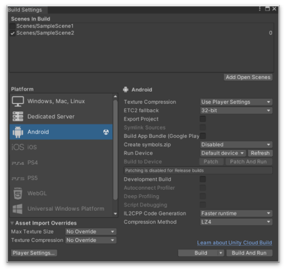 

&nbsp;

&nbsp;

# OpenXR

“OpenXR in Unity serves as a bridge between Unity applications and various VR/AR platforms, enabling developers to create XR experiences that can run on multiple XR devices without needing to rewrite code for each device or platform. It is an open, royalty-free standard for cross-platform VR and AR development, created by the Khronos Group. OpenXR simplifies the development process, reduces fragmentation, and ensures better compatibility across different XR devices.“

&nbsp;

&nbsp;

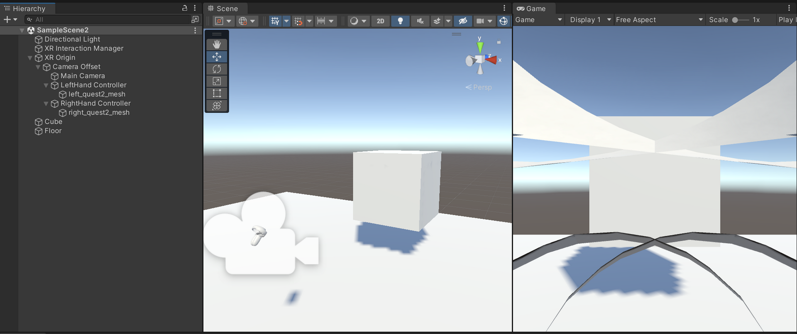

&nbsp;

* * *

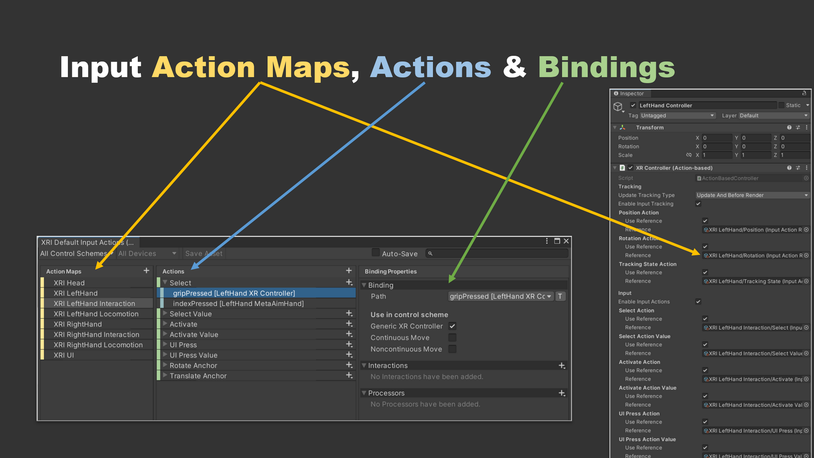

* * *

&nbsp;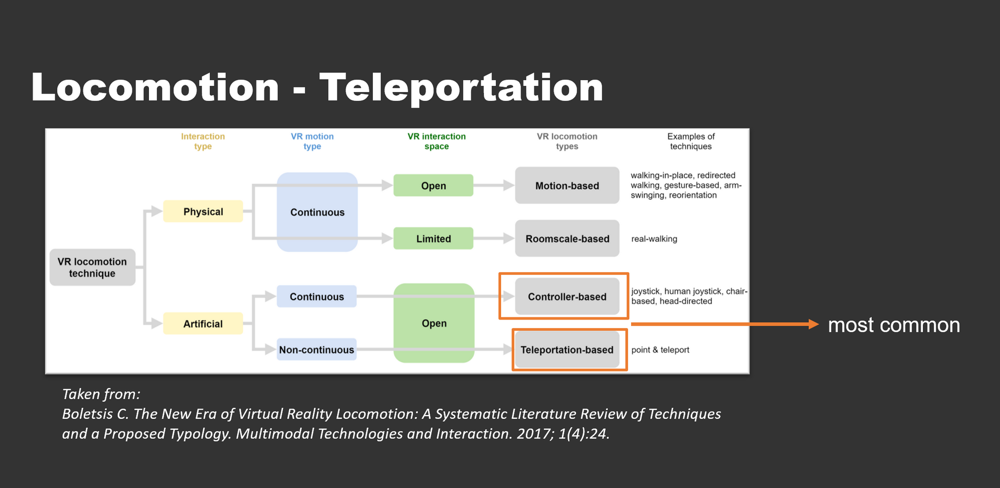

* * *

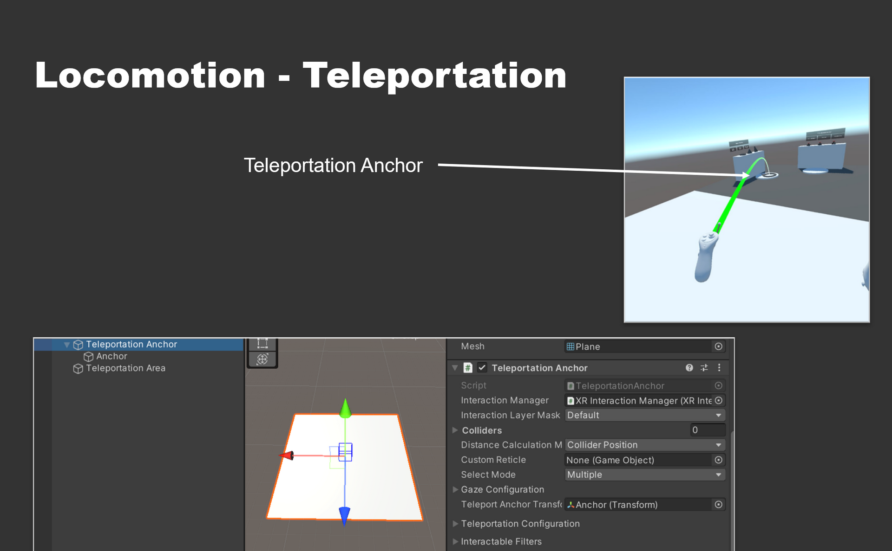

* * *

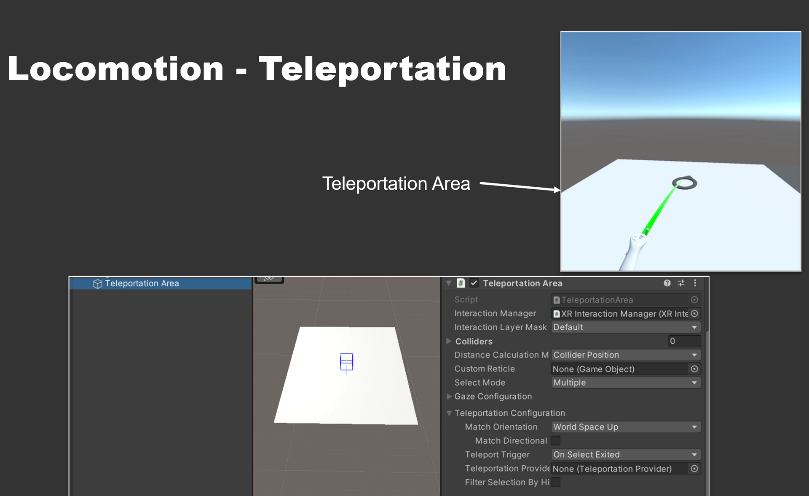

&nbsp;

# Locomotion - Turning

Choose either one:

- Snap Turn Provider:  
    turns player around by certain amount of degrees
- Continuous Turn Provider:  
    turns player around continuously while pressing the joystick  
    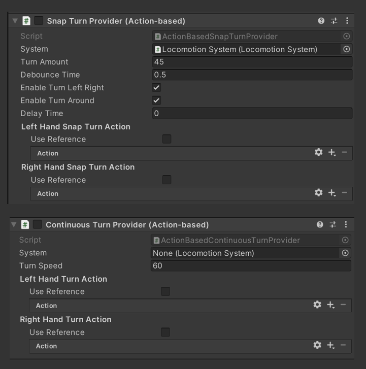

&nbsp;

# Interactables

- Components for executing functions, based on interaction events
- E.g.: hovering is triggered from moving controller over the object. Select is triggered when selection button is pressed while hovering

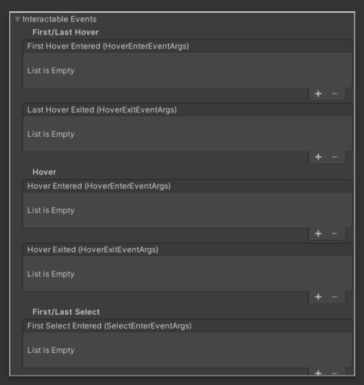 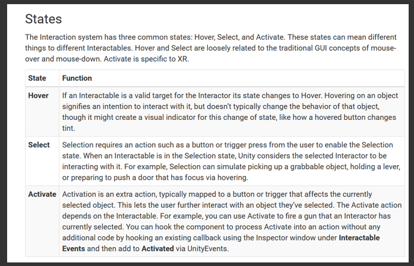

&nbsp;

# Interactables - Simple Interactable

- Basic objects used for triggering events, e.g. via gaze or button interactions

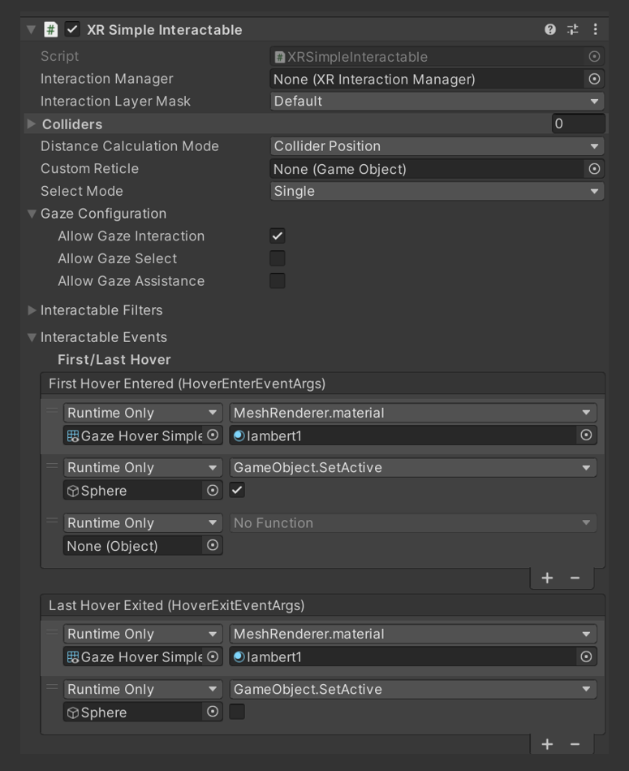

&nbsp;

# Interactables - Grab Interactable

- Direct and physical form of interacting with virtual objects, e.g. for picking them up, rotating or scaling them

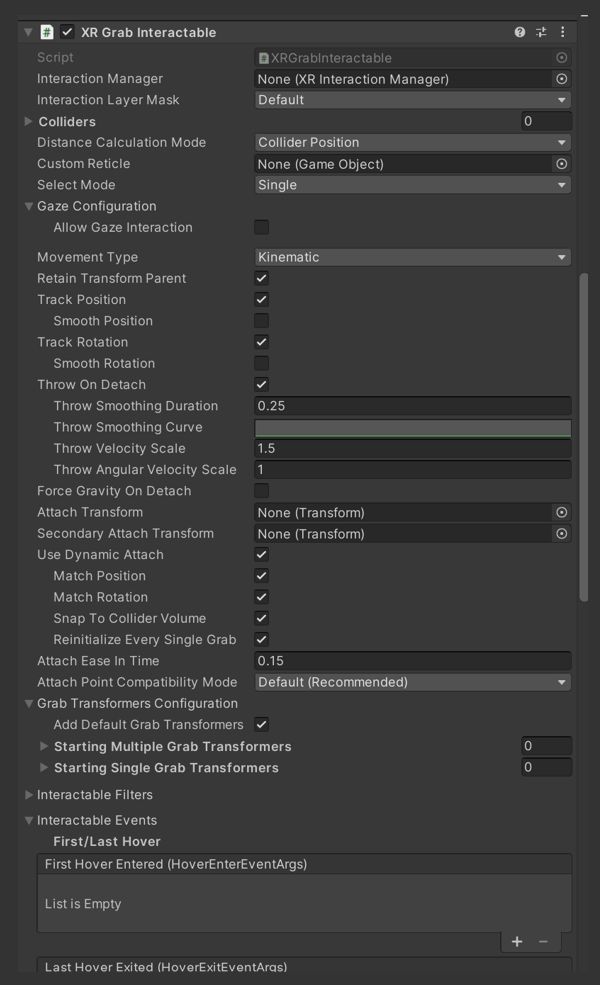

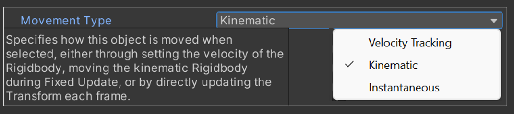