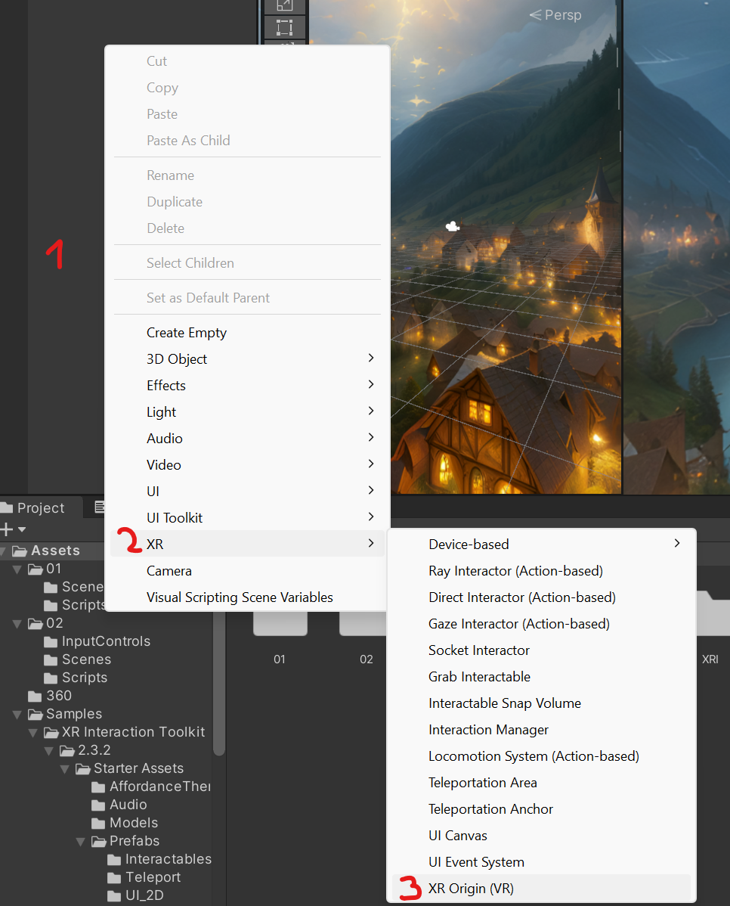
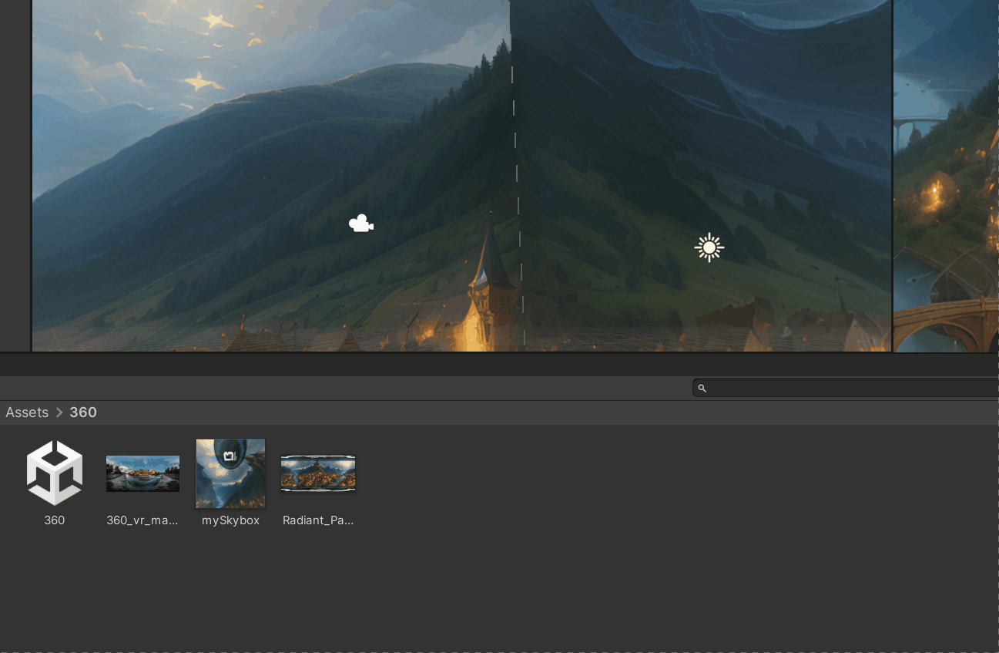

# 360 image (Skybox)

- Game Engines like Unity use the concept of Skyboxes for rendering 360 environment textures.

&nbsp;

- Follow these steps to create a new Material, make it a Skybox and assign to it a 360 image which you can generate here : https://skybox.blockadelabs.com/
- Drop the Skybox material intro the Scene view.
- 

&nbsp;

- Delete the MainCamera from your scene and add an *XR Origin (VR)* object
- You can also add a Device Simulator to preview.

&nbsp;

&nbsp;

&nbsp;

# 360 video

- Download a free 360 video from here: https://www.mettle.com/360vr-master-series-free-360-downloads-page/  
    Make sure to choose the highest possible resolution!
- Import it to the project and create a *Render Texture* with the same resolution as the video (4069x2048).

&nbsp;

- Now create a VideoPlayer object in the open scene. 
- Assign the *Render Texture* to it and assign the VideoClip..
- Select the Skybox Material from earlier and drop the *Render Texture* into the box next to "Spherical (HDR)".
- Press Play and voilá you have a 360 video!

&nbsp;

