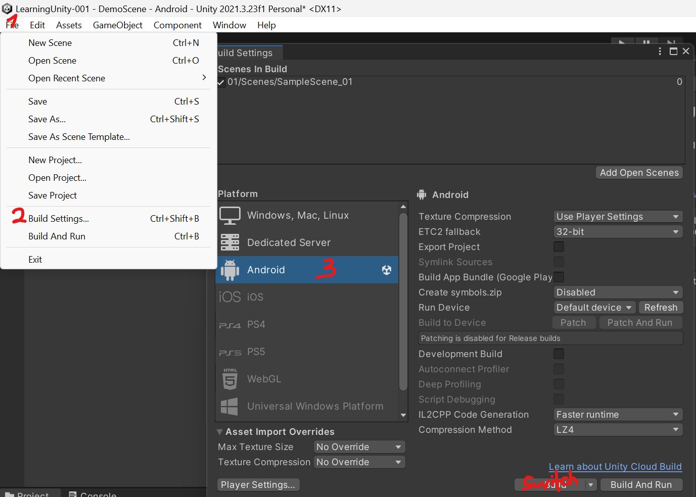
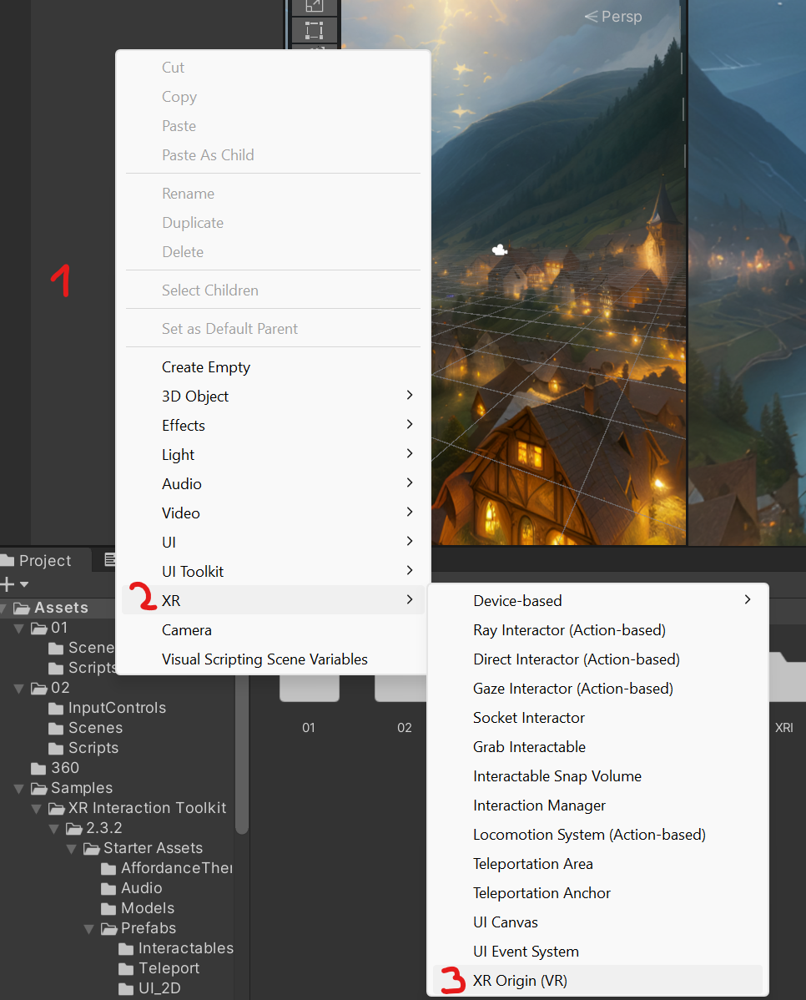

# Hands on VR:

# Starter Assets

&nbsp;

&nbsp;

- In our Unity project, go to Window > Package Manager and make sure the *Packages: Unity Registry* dropdown is selected.
- Then search for "xr" and install the *OpenXR Plugin, XR Interaction Toolit and XR Plugin Management.*

&nbsp;

- In the *Build Settings*, make sure to switch to Android.

&nbsp;

- In the *Package Manager* when selected *Packages: In Project* you can see the previously installed packages. Select the *XR Interaction Toolkit* and import the *Starter Assets* and the *XR Device Simulator*.

&nbsp;

&nbsp;

- In the Project Settings, open *OpenXR* settings and add the Oculus Touch Controller Profile. Also check *Meta Quest Support,* *Mock Runtime* and *Runtime Debugger*. If a red exclamation mark appears next to either of the settings, click on it and select "Fix all".

&nbsp;

&nbsp;

- Now you can open the DemoScene in the imported Starter Assets from the Assets folder.

&nbsp;

- In order to simulate an XR/ VR device in the Editor, we can use the *XR Device Simulator.* Just drop it into the DemoScene.
- !! When you build a scene, make sure to deactivate the XR Device SImulator object before, otherwise you can't interact with the scene on your VR headset.

&nbsp;

- Here is an overview for the keyboard shortcuts for handling the simulator in the Editor: [https://connect-prd-cdn.unity.com/20210604/28db6ca9-aba1-4ac3-a15a-24664daff3ea/Rig Simulator Keyboard Shortcuts.pdf](https://connect-prd-cdn.unity.com/20210604/28db6ca9-aba1-4ac3-a15a-24664daff3ea/Rig%20Simulator%20Keyboard%20Shortcuts.pdf)
- And here is a video from Unity explaining the simulator: https://learn.unity.com/tutorial/vr-project-setup#65c511fbedbc2a263ed98727

&nbsp;

Explore the scene and interactions!

&nbsp;

&nbsp;

# 360 image (Skybox)

- Game Engines like Unity use the concept of Skyboxes for rendering 360 environment textures.

&nbsp;

- Follow these steps to create a new Material, make it a Skybox and assign to it a 360 image which you can generate here : https://skybox.blockadelabs.com/
- Drop the Skybox material intro the Scene view.
-   
    

&nbsp;

- Delete the MainCamera from your scene and add an *XR Origin (VR)* object
- You can also add a Device Simulator to preview.

&nbsp;

&nbsp;

&nbsp;

# 360 video

- Download a free 360 video from here: https://www.mettle.com/360vr-master-series-free-360-downloads-page/  
    Make sure to choose the highest possible resolution!
- Import it to the project and create a *Render Texture* with the same resolution as the video (4069x2048).

&nbsp;

- Now create a VideoPlayer object in the open scene.
- Assign the *Render Texture* to it.
- Select the Skybox Material from earlier and drop the *Render Texture* into the box next to "Spherical (HDR)".
- Press Play and voilá you have a 360 video!

&nbsp;

