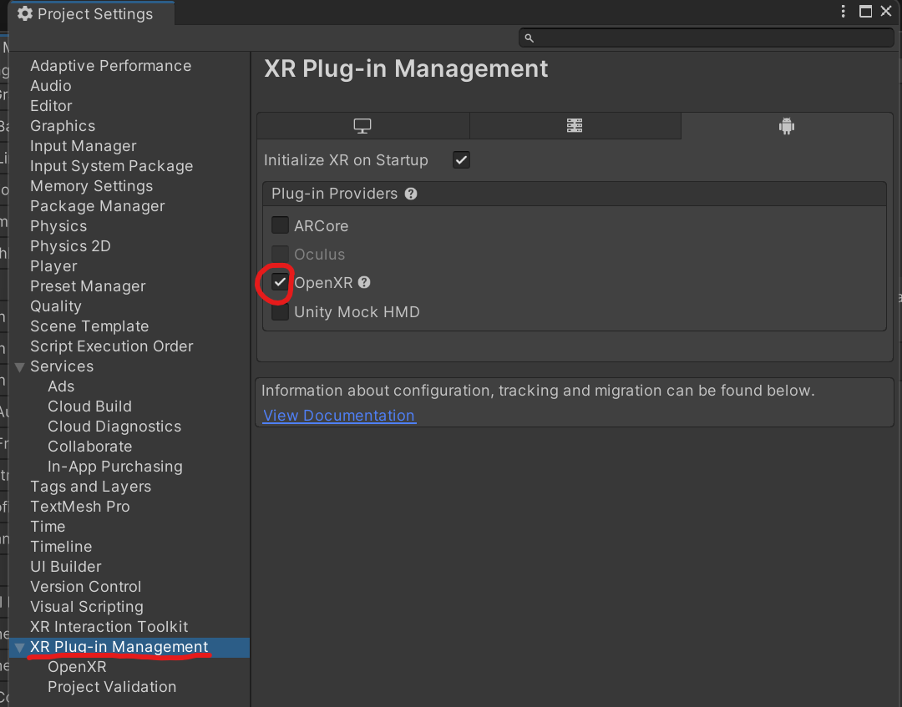

# Hands on VR:

&nbsp;

- In our Unity project, go to Window > Package Manager and make sure the *Packages: Unity Registry* dropdown is selected. This shows the available packages to install, while *In Project* displays the previously installed packages.
- Search for "xr" and install the *OpenXR Plugin, XR Interaction Toolit and XR Plugin Management.*

&nbsp;

- In the *Build Settings*, make sure to switch to Android.

&nbsp;

- In the Project Settings, open *XR Plug-in Management* and check *OpenXR*.

- Open *OpenXR* settings and add the Oculus Touch Controller Profile. Also check *Meta Quest Support,* *Mock Runtime* and *Runtime Debugger*. If a red exclamation mark appears next to either of the settings, click on it and select "Fix all".

&nbsp;

- In case the warning sign appears, click on it and fix the issues that appear under *Project validation*.

&nbsp;

&nbsp;