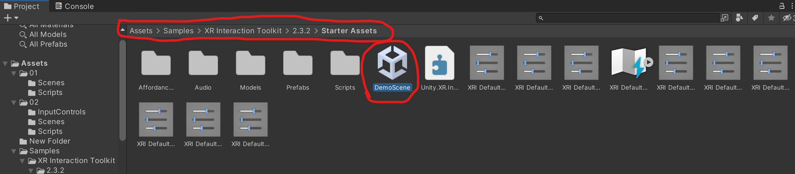
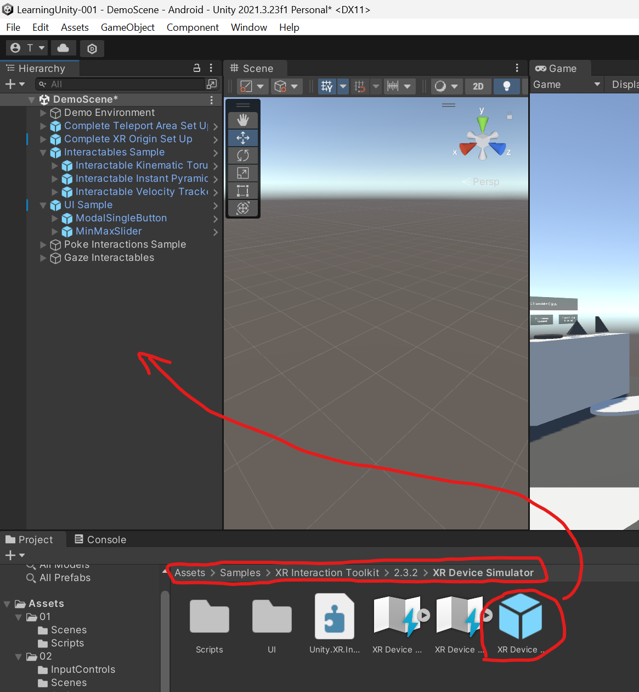
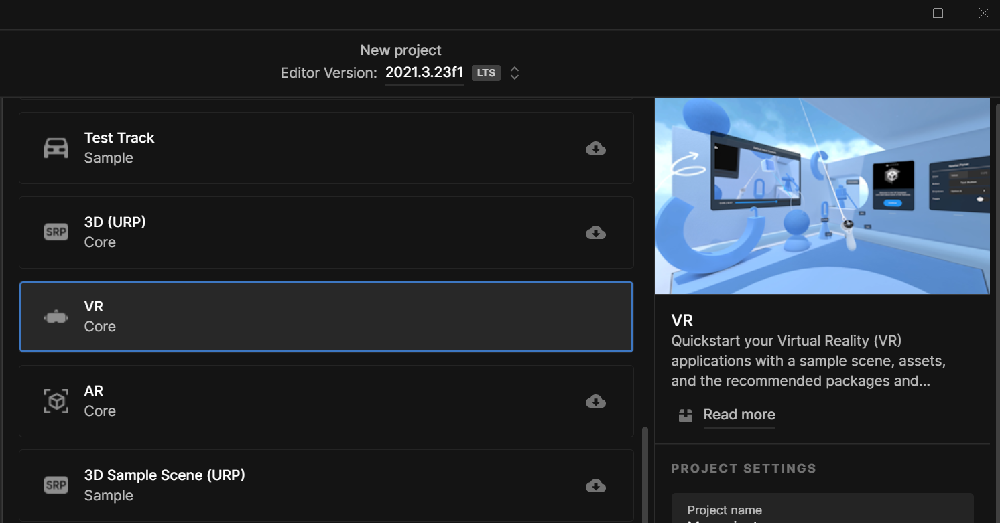

# Starter Assets

## Setup

- In the *Package Manager* select the *XR Interaction Toolkit* and import the *Starter Assets* and the *XR Device Simulator*.

&nbsp;

&nbsp;

&nbsp;

- Now you can open the DemoScene in the imported Starter Assets from the Assets folder.

&nbsp;

## XR Device Simulator

- In order to simulate an XR/ VR device in the Editor, we can use the *XR Device Simulator.* Just drop it into the DemoScene.
- ==!! Make sure to deactivate the XR Device SImulator object **before building an .apk**, otherwise interaction won't work.==

&nbsp;

- Here is an overview for the keyboard shortcuts for handling the simulator in the Editor: [https://connect-prd-cdn.unity.com/20210604/28db6ca9-aba1-4ac3-a15a-24664daff3ea/Rig Simulator Keyboard Shortcuts.pdf](https://connect-prd-cdn.unity.com/20210604/28db6ca9-aba1-4ac3-a15a-24664daff3ea/Rig%20Simulator%20Keyboard%20Shortcuts.pdf)
- And here is a video from Unity explaining the simulator: https://learn.unity.com/tutorial/vr-project-setup#65c511fbedbc2a263ed98727

&nbsp;

Explore the scene and interactions!

&nbsp;

## Let's modify the interactions!

- First, try to understand the scene. You can delete objects from the hierarchy to figure out what is what (just don't save the scene). The "Interactables Sample" objects are grabable objects, "Poke Interactions Sample" object contain the push buttons and "Gaze Interactables" the objects that are triggered by looking at them.
- In the interactable components you will find a dropdown for *Interactable Events*, this is where you can trigger stuff to happen from interacting with the objects. Check out \[2_Intro VR\]([2_Intro VR](:/929f3e17bb6344ce98bd692b29ac33fe)) for more information on interactables and the official documentation: https://docs.unity3d.com/Packages/com.unity.xr.interaction.toolkit@3.0/manual/architecture.html.

&nbsp;

- Copy the script *SkyboxHandler*  from "Scripts" and follow the steps below:

## Further explorations

Can you...

- ... figure out how to trigger the 360-videoplayer from pushing the 3rd button?
- ... create a cube that can be grabbed and used as a racket to hit a ball?
- ... figure out how the locomotion works and make your own spot to teleport to (*Teleport Anchor*)?

&nbsp;

Now that you managed to set up a whole VR project on your own, you can download the VR template and create a new project based on that. There are more examples to explore and to modify. Just break them apart and figure them out (chances are only 50/50 that you will break the engine ;) )

&nbsp;

## If you managed to get here, you know already more about VR development in Unity than the majority of the world's population :D

&nbsp;

&nbsp;
