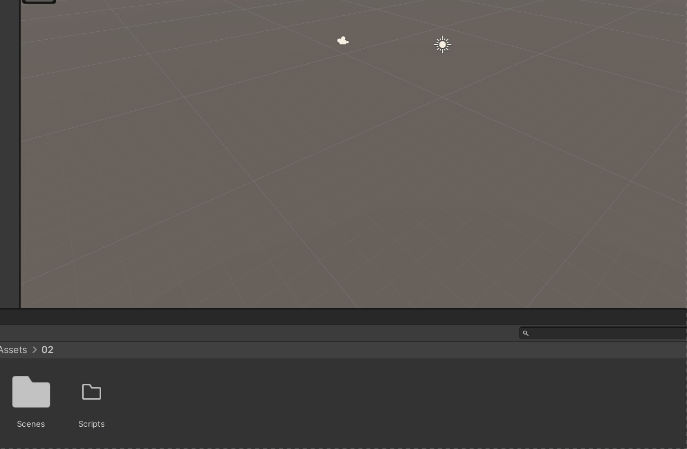
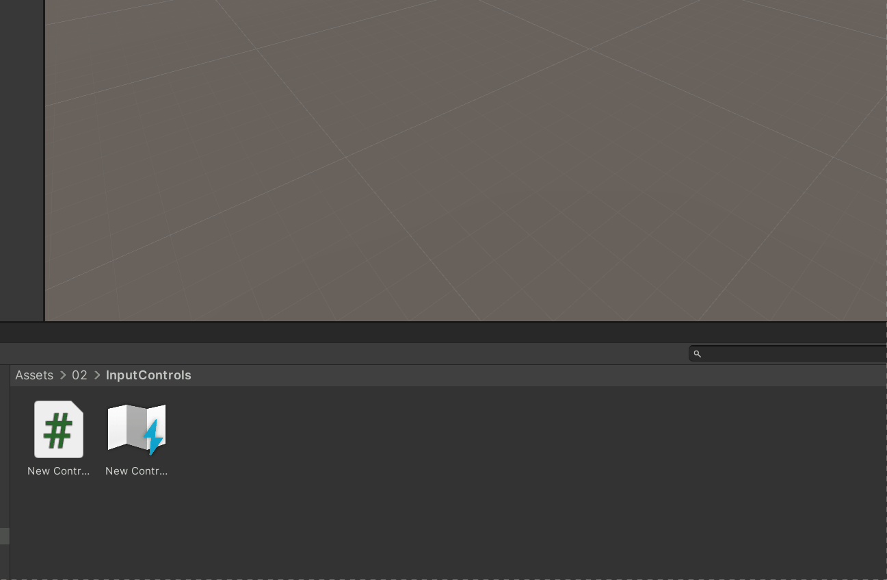
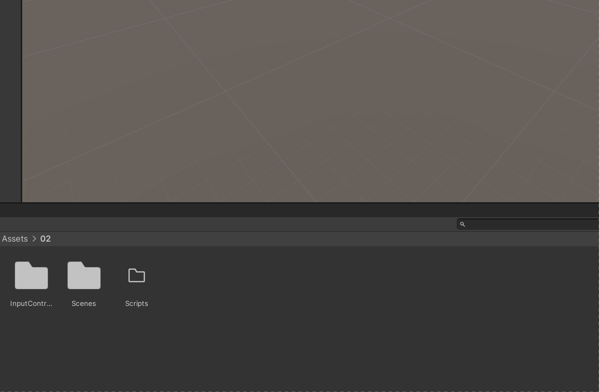
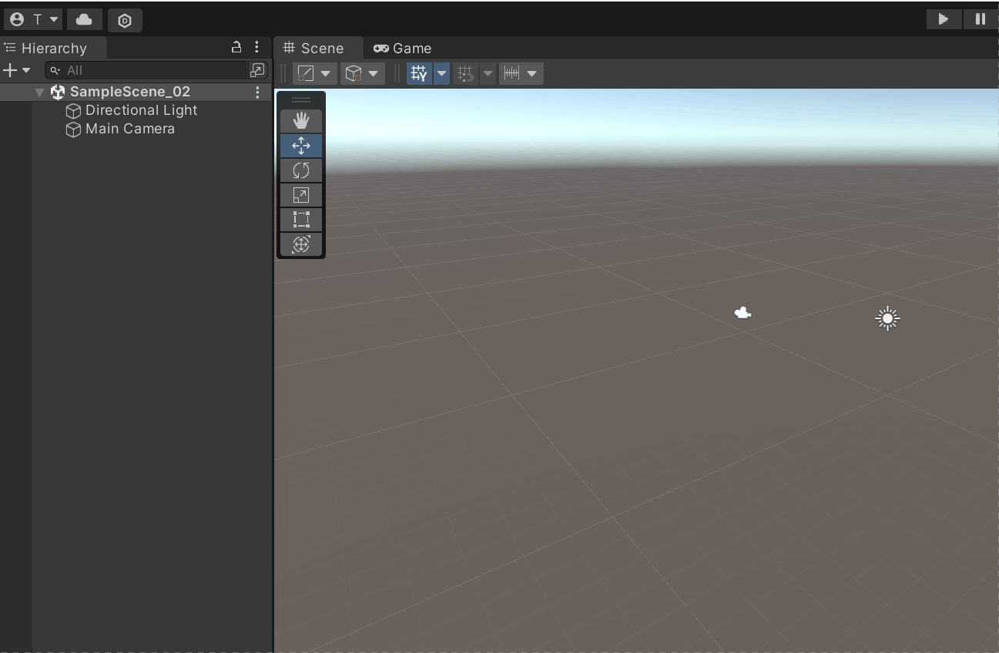

&nbsp;

# Input System:

## Old vs. New:

- Input Handling has been upgraded to be more modular and configurable
- In Unity 2021 both can be activated
- recommendation: focus on the new one, as you will encounter it in many resources.

* * *

- Enable new *Input System* by selecting "both" as *Active Input Handling* in PlayerSettings.

&nbsp;

- Note: since we are using Unity 2021 (which is the version installed on the Lab iMacs) we have to install the package separately. If you are using 2022 it will come already preinstalled.

&nbsp;

- Create an *InputAction.*
- Tick *Generate C# class*.

&nbsp;

- Rename Action asset and edit it.
- Create *ActionMap* and an *Action.*
- Add a *Binding* to the *Action*.

&nbsp;

# Option 1) Create a script to implement the controls

- Add reference to the "MyControls_1" class (auto-generated from the Action asset). If you named the Action asset differently, you need change the reference name.
- Here we setup the controls and assign a function to be called when the "*Spacebar_Action*" is performed.  
    `public void Awake() { controls = new MyControls_1(); controls.ActionMap_1.Spacebar_Action.performed += ctx => OnSpacebar(); }`

&nbsp;

- Create a new GameObject in the open scene and name it "InputHandler".
- Add the *InputHandler* script/component to it and press *Playmode*. Now a console message should appear when you hit the spacebar key.
- Cool! You just designed a first interaction.

# Option 2) use PlayerInput component

- add *PlayerInput* component to a GameObject.
- add a new cube as GameObject to the scene.
- select your Action, set Behvaiour to *Invoke Unity Events.*
- under Events, open the dropdowns and in the *Spacebar_Action* field assign the GameObject and function you want to trigger (e.g. GameObject.SetActive = true/false).
- if you run the scene and hit spacebar it should show or hide the cube, based on what you assigned.

&nbsp;

Find out more about the new InputSystem here:

- [QuickStartGuide.html](https://docs.unity3d.com/Packages/com.unity.inputsystem@1.8/manual/QuickStartGuide.html "https://docs.unity3d.com/Packages/com.unity.inputsystem@1.0/manual/QuickStartGuide.html")
- [Actions.html](https://docs.unity3d.com/Packages/com.unity.inputsystem@1.8/manual/Actions.html#creating-actions "https://docs.unity3d.com/Packages/com.unity.inputsystem@1.0/manual/Actions.html#creating-actions")

&nbsp;

* * *

&nbsp;

# Mouse Input (vector values)

&nbsp;

&nbsp;

&nbsp;

==Take away: there are many different ways to work with Input Actions==